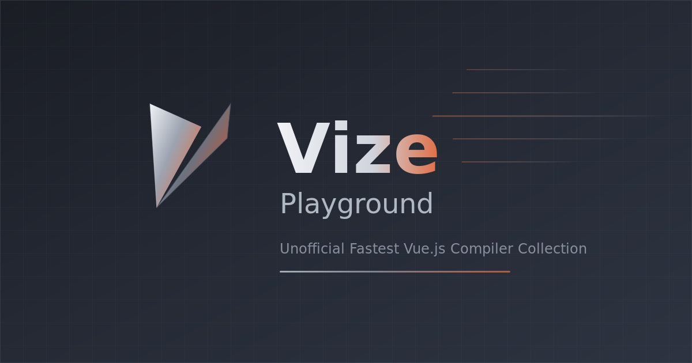

<p align="center">
  
</p>

<p align="center">
  <strong>Unofficial High-Performance Vue.js Toolchain in Rust</strong>
</p>

<p align="center">
  <em>/viːz/ — Named after Vizier + Visor + Advisor: a wise tool that sees through your code.</em>
</p>

<p align="center">
  <a href="https://vizejs.dev"><strong>Documentation</strong></a> ・
  <a href="https://vizejs.dev/play/"><strong>Playground</strong></a> ・
  <a href="https://github.com/sponsors/ubugeeei"><strong>Sponsor</strong></a>
</p>

<p align="center">
  <a href="https://crates.io/crates/vize"></a>
  <a href="https://www.npmjs.com/package/vize"></a>
  <a href="https://www.npmjs.com/package/@vizejs/vite-plugin"></a>
  <a href="https://www.npmjs.com/package/@vizejs/wasm"></a>
  <a href="https://github.com/ubugeeei/vize/blob/main/LICENSE"></a>
</p>

> [!WARNING]
> This project is under active development and is not yet ready for production use.
> APIs and features may change without notice.

---

## Features

- **Compile** — Vue SFC compiler (DOM / Vapor / SSR)
- **Lint** — Vue.js linter with i18n diagnostics
- **Format** — Vue.js formatter
- **Type Check** — TypeScript type checker for Vue
- **LSP** — Language Server Protocol for editor integration
- **Musea** — Component gallery (Storybook-like)
- **MCP** — AI integration via Model Context Protocol

## Quick Start

```bash
npm install -g vize
```

```bash
vize build src/**/*.vue    # Compile
vize fmt --check           # Format check
vize lint --fix            # Lint & auto-fix
vize check --strict        # Type check
```

See the [documentation](https://vizejs.dev) for detailed usage, Vite plugin setup, WASM bindings, and more.

## Performance

Benchmarks with **15,000 Vue SFC files** (36.9 MB). "User-facing speedup" = traditional tool (single-thread) vs Vize (multi-thread).

| Tool | Traditional (ST) | Vize (MT) | User-facing Speedup |
|------|-----------------|-----------|---------------------|
| **Compiler** | @vue/compiler-sfc 10.52s | 380ms | **27.7x** |
| **Linter** | eslint-plugin-vue 65.30s | patina 5.48s | **11.9x** |
| **Formatter** | Prettier 82.69s | glyph 23ms | **3,666x** |
| **Type Checker** | vue-tsc 35.69s | canon 472ms | **75.5x** * |
| **Vite Plugin** | @vitejs/plugin-vue 16.98s | @vizejs/vite-plugin 6.90s | **2.5x** ** |

<details>
<summary>Detailed compiler benchmark</summary>

|  | @vue/compiler-sfc | Vize | Speedup |
|--|-------------------|------|---------|
| **Single Thread** | 10.52s | 3.82s | **2.8x** |
| **Multi Thread** | 3.71s | 380ms | **9.8x** |

</details>

\* canon is still in early development and does not yet cover the full feature set of vue-tsc. The speedup partly reflects the difference in work performed.

\*\* Vite Plugin benchmark uses Vite v8.0.0-beta.15 (Rolldown). The plugin replaces only the SFC compilation step; all other Vite internals are unchanged.

Run `mise run bench:all` to reproduce all benchmarks.

## Contributing

See the [documentation](https://vizejs.dev) for architecture overview and development setup.

## Credits

This project is inspired by and builds upon the work of these amazing projects:
[Volar.js](https://github.com/volarjs/volar.js) ・ [vuejs/language-tools](https://github.com/vuejs/language-tools) ・ [eslint-plugin-vue](https://github.com/vuejs/eslint-plugin-vue) ・ [eslint-plugin-vuejs-accessibility](https://github.com/vue-a11y/eslint-plugin-vuejs-accessibility) ・ [Lightning CSS](https://github.com/parcel-bundler/lightningcss) ・ [Storybook](https://github.com/storybookjs/storybook) ・ [OXC](https://github.com/oxc-project/oxc)

## Sponsors

This project is maintained by [@ubugeeei](https://github.com/ubugeeei). If you find Vize useful, please consider [sponsoring](https://github.com/sponsors/ubugeeei).

## License

[MIT](./LICENSE)
