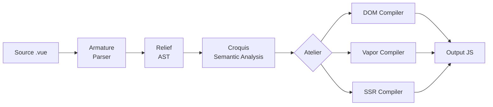
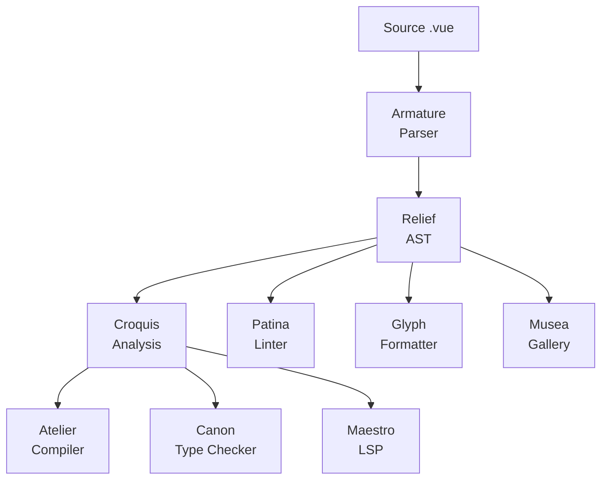

# Architecture Overview

> **⚠️ Work in Progress:** Vize is under active development and is not yet ready for production use. Internal architecture may change as the project evolves.

Vize is built as a modular Rust workspace where each crate handles a specific concern. The architecture follows a pipeline model, transforming Vue SFC source code through parsing, analysis, and compilation stages.

## Pipeline

### Stage Details

1. **Source** — A `.vue` file containing `<template>`, `<script>`, and `<style>` blocks
2. **Armature** (Parser) — Tokenizes the raw source into a stream of tokens, then parses them into a structured AST. The tokenizer handles Vue-specific syntax: directives (`v-if`, `v-for`, `v-bind`), expression interpolation (`{{ }}`), and SFC block boundaries.
3. **Relief** (AST) — The intermediate representation. All downstream stages operate on this shared AST, eliminating redundant parsing.
4. **Croquis** (Semantic Analysis) — Resolves template expressions, tracks variable scopes, detects binding types (setup, data, props, inject), and validates expression correctness. Uses OXC for JavaScript/TypeScript AST parsing.
5. **Atelier** (Compilation) — Transforms the analyzed AST into JavaScript output. Three backends serve different targets:
   - **DOM** (`vize_atelier_dom`) — `createVNode`/`h` calls with patch flag optimization and static hoisting
   - **Vapor** (`vize_atelier_vapor`) — Fine-grained reactive code with direct DOM manipulation (no VDOM)
   - **SSR** (`vize_atelier_ssr`) — String concatenation with hydration markers
6. **Output** — Generated JavaScript code with source maps

## Tool Pipeline

Beyond compilation, Vize provides additional tools that reuse the same parsing and analysis infrastructure:

Because all tools share the same parser and AST, they have a consistent understanding of your code. A lint rule in Patina operates on the same AST nodes as the compiler in Atelier — there's no risk of parser disagreement.

## Crate Responsibilities

| Layer | Crate | Role |
|-------|-------|------|
| Foundation | `vize_carton` | Shared utilities, arena allocator, string interning |
| AST | `vize_relief` | AST node definitions, error types, compiler options |
| Parsing | `vize_armature` | Tokenizer + recursive descent parser |
| Analysis | `vize_croquis` | Semantic analysis, scope tracking, binding detection |
| Compilation | `vize_atelier_core` | Shared transforms, codegen utilities, source maps |
| Compilation | `vize_atelier_dom` | DOM (VDom) code generation |
| Compilation | `vize_atelier_vapor` | Vapor mode code generation |
| Compilation | `vize_atelier_sfc` | SFC orchestration (script + template + style + HMR) |
| Compilation | `vize_atelier_ssr` | Server-side rendering compilation |
| Bindings | `vize_vitrine` | Node.js (NAPI) + WASM bindings |
| CLI | `vize` | Command-line interface (clap + rayon) |
| Type Checking | `vize_canon` | TypeScript type checker for templates |
| Linting | `vize_patina` | Vue.js linter with i18n (en/ja/zh) |
| Formatting | `vize_glyph` | Vue.js formatter (template + script + style) |
| LSP | `vize_maestro` | Language Server Protocol (tower-lsp) |
| Gallery | `vize_musea` | Component gallery (Storybook alternative) |
| TUI | `vize_fresco` | Terminal UI framework (crossterm + taffy) |

## Naming Convention

Vize crates are named after **art and sculpture terminology**, reflecting how each component shapes and transforms Vue code. This naming system is more than aesthetic — it encodes the role and relationships between crates. See [Philosophy](../philosophy.md) for the full rationale.

| Name | Origin | Art Analogy | Technical Role |
|------|--------|-------------|----------------|
| **Carton** | /kɑːˈtɒn/ | Artist's portfolio case — stores and organizes tools | Shared utilities — the foundational toolbox that every crate depends on |
| **Relief** | /rɪˈliːf/ | Sculptural technique that projects from a flat surface | The AST — a structured surface that gives shape to raw source code |
| **Armature** | /ˈɑːrmətʃər/ | Internal skeleton supporting a sculpture | The parser — the structural framework that supports the AST |
| **Croquis** | /kʁɔ.ki/ | Quick gestural sketch capturing the essence of a subject | Semantic analysis — a quick pass that captures the meaning of code |
| **Atelier** | /ˌætəlˈjeɪ/ | Artist's workshop where creation happens | Compiler workspaces — where code is transformed into its final form |
| **Vitrine** | /vɪˈtriːn/ | Glass display case in a museum | Bindings — a transparent layer that exposes the compiler to external consumers |
| **Canon** | /ˈkænən/ | Standard of ideal proportions in classical sculpture | Type checker — ensures code conforms to the standard of correctness |
| **Patina** | /ˈpætɪnə/ | Aged surface finish that indicates quality and care | Linter — polishes code by identifying issues that affect quality |
| **Glyph** | /ɡlɪf/ | Carved symbol or letterform with precise proportions | Formatter — shapes code into consistent, readable letterforms |
| **Maestro** | /ˈmaɪstroʊ/ | Master conductor who orchestrates an ensemble | LSP — orchestrates all language features into a unified editor experience |
| **Musea** | /mjuːˈziːə/ | Plural of museum — a space for exhibiting art | Component gallery — a space for exhibiting and exploring components |
| **Fresco** | /ˈfrɛskoʊ/ | Painting technique applied to wet plaster walls | TUI framework — painting interfaces onto the terminal surface |

### Why Art Terminology?

The analogy between software compilation and artistic creation is surprisingly deep:

- A **parser** (Armature) provides the internal skeleton — the structure that everything else builds upon, just as a sculptor's armature supports the clay
- **Semantic analysis** (Croquis) is like a quick sketch — it captures the essential meaning without committing to a final form
- The **compiler** (Atelier) is a workshop where raw material is transformed into a finished work
- The **AST** (Relief) is a projection — it gives three-dimensional structure to what was originally flat text
- **Bindings** (Vitrine) are a glass display case — they let you see and interact with the work inside without directly touching it
- The **linter** (Patina) examines the surface finish — finding imperfections that affect the overall quality
- The **formatter** (Glyph) ensures consistent proportions — like a typographer carving letterforms with precise spacing

This naming convention makes the crate hierarchy intuitive: when you see `vize_atelier_dom`, you immediately understand it is a *workshop* that produces *DOM output*.

## External Dependencies

Vize integrates with the broader Rust ecosystem for specialized tasks:

| Dependency | Purpose | Used By |
|-----------|---------|---------|
| [OXC](https://oxc.rs/) | JavaScript/TypeScript AST parsing | `vize_croquis`, `vize_atelier_core` |
| [Rayon](https://docs.rs/rayon) | Data-parallel multi-threading | `vize`, `vize_vitrine` |
| [bumpalo](https://docs.rs/bumpalo) | Arena allocation for AST nodes | `vize_carton` |
| [LightningCSS](https://lightningcss.dev/) | CSS parsing and transformation | `vize_atelier_sfc` |
| [tower-lsp](https://docs.rs/tower-lsp) | LSP server framework | `vize_maestro` |
| [clap](https://docs.rs/clap) | CLI argument parsing | `vize` |
| [wasm-bindgen](https://rustwasm.github.io/wasm-bindgen/) | WASM-JavaScript interop | `vize_vitrine` |
| [napi-rs](https://napi.rs/) | Node.js native addon bindings | `vize_vitrine` |
